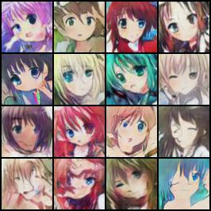
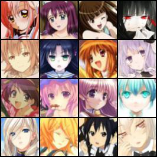

# 代码说明
在原有代码的基础上进行了少许优化，可以训练生成动漫头像，效果如下(左为假，右为真)。

## 运行说明
` python main.py --checkpoint_dir checkpoint_dcgan --model dcgan --dataset ANIME-face --device 0`

运行环境需要安装pytorch

需要将loader.py中的base_dir改为数据集所在地址

动漫头像数据集下载链接：https://pan.baidu.com/s/1VdiYs9TUHZ5dRmO8qv5aJw 密码: 851h

每训练5个epoch保存模型训练结果到checkpoint_dir中，训练情况记录checkpoint_dir/logs.json中，可以运行draw_picture.py查看训练中loss的变化情况。

## 代码一览
- main.py：提取命令行中参数，调用loader.py中start_trainer函数开始训练

- loader.py：提取数据集，根据模型调用models中不同模型进行训练

- models

  dcgan.py：原始的DCGAN模型

  dcgan_sa.py：加入self-attention机制的DCGAN模型

  dcgan_sn.py：进行谱归一化后的DCGAN模型

  dcgan_un.py：增加梯度项后的DCGAN模型

  spectral_normalization.py：实现谱归一化

- evaluation

  FID.py：计算训练结果的FID值

  IS.py：计算训练结果的IS值

- utils.py：保存训练结果

- draw_picture.py：训练结果可视化
